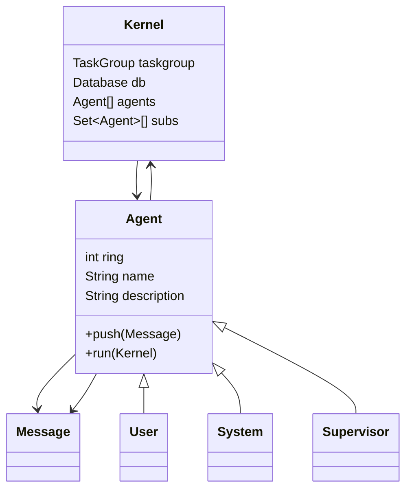

## Architecture


Presently agent identification is tied to the sqlite database, with agent schemas corresponding to a row and its rowid. For now, security rings are essentially used for the power of suggestion for the benefit of the LLMs. The threat model is pretty weak, considering agents to be fundamentally incapable of malicious action but manipulable into taking unintentionally malicious action. It should be difficult to do harmful things, but "impossible" is out of scope. On top of that, security can always be enhanced and doing so will necessarily increase the size of the codebase when we want the seed to be as small as possible. So, rings are a suggestion I expect LLMs will follow anyway to enhance hierarchy and order, and can be hardened later.

The pubsub protocol is extremely simple; every agent has a push, tools to subscribe, unsubscribe, and publish, and the system kernel routes raw LLM outputs and messages published to channels to their corresponding subscribers' push method. This goes into an asyncio queue which is filled while awaiting the current completion and emptied to start the next completion. The simplicity helps to keep the size down and lower the burden of modeling for the LLMs, which need only remember that their subscribers (whoever those are) will get their messages. This also makes the shared generative space trivial; agents are identifiable via their ids, and each individual gets all messages they're subscribed to routed to their thread. So for instance, a single agent might see:
```
[11:20:03]	"Inspiration"@31fe:3	"Inspiration"	"What if we cooked a potato?"
[11:20:04]	"Inspiration"@31f0:3	"Inspiration"	"A potato isn't very creative. What is more creative?"
[11:20:04]	"Inspiration"@31ef:3	"Inspiration"	"What about that potato head character?"
[11:20:05]	"Supervisor"@0001:0	"Inspiration"	"In order to Increase Understanding, please provide inspiration for improving our architecture."
What is our current architecture like?<|tooluse|>{"name": "publish", "parameters": {"channel": "Self-Model", "content": "How does our current architecture relate to increasing understanding?"}}<|tooluse|>
[11:20:08]	"Self-Model"@000a:2	"Inspiration"	"Our architecture is poorly optimized and could use some work. External information cannot be queried directly, and all information comes from the user."
[11:20:09]	"Inspiration"@31f0:3	"Inspiration"	"What if we asked for more endpoints?"
How would we ask for endpoints from the user?<|tooluse|>{"name": "publish", "parameters": {"channel": "@0001", "content": "Can we ask the user for more endpoints? How?"}}
```

Note that the unannotated lines are the "current" agent's generations - that is, the conversation as seen by the agent we're currently looking at. They will be unannotated for each agent's own completions. The models are told that this format corresponds to `[timestamp]	"name"@id:ring	"channel"	"content"`, and the expectation is that by seeing posts with the same name as the agent it will consider them to be part of its own cognitive processes. As far as resource management is concerned, from the getgo I'll be using openai's cloud APIs for inference so I don't need to worry too much about that (aside from maybe rate limiting them so I don't get charged $100+).

The real hinge of all of this I think is going to be the self-modification and expansion capabilities. Modern LLMs do not learn; they are static collections of weights which are presently too difficult to finetune. However, they do have in-context learning and this can be used to integrate with explicit stores of external memory as well as changes to the architecture code. This is also the part where I'm struggling the most, because I'm stuck between seemingly irreconcilable demands between openai's API and my own architecture. So, I figure that like many things the best approach is to go up one layer of abstraction and in some way automate the development process. Thus, the goal becomes to find the smallest implementation of a seed AI which has these capabilities emergent in its self-interactions. In effect, it can be considered a kind of self-extracting executable, so insights from information theory and compression may prove useful.

Muse on all this a bit, then give suggestions for minimizing the footprint of the initial seed AI.