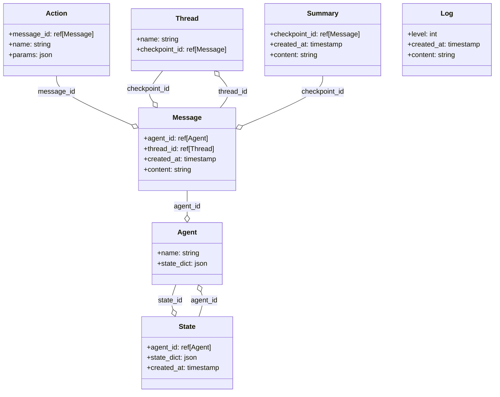

# Tobio
Library to assist in creating artificial people, named after Tobio Tenma. This serves as a bottom-up cognitive architecture which handles persona curation, memories, emotional feedback loops, model interfacing, multi-agent processing, and a barebones web UI.

A few key unstructured points:
- Configuration should be possible primarily through static files
- Minimal coding, only needed to change runtime behavior
- Bottom-up but with minimal coupling using techniques learned from top-down attempts
- Agents come in 3 parts: code (runtime behavior), config (immutable initialization which is provided as part of its definition, eg an Assistants-based agent might have an assistant_id in its config), and state (persistent mutable state saved via state_dict method)

TODO:
- Agent command subsystem
- UserAgent

## Concepts
### Kernel
The kernel is the core of the system, a central dynamically configurable object which manages shared resources, coordinates agents, and facilitates message transport. It is deliberately modeled after the linux kernel and incorporates lessons from previous top-down attempts at implementing an artificial person. Coupling and state quickly becomes unwieldy even with simple setups. The built-in functionalities are:
- Task management
- Module linking
- Commands
- Providers
- Models
- Database

### Modules
Modules are modeled after LKMs. They define a name, a list of dependencies, a `module_init`, and a `module_exit`. The dependencies are the actual module types which must be loaded - this is mostly for type-checking purposes, but it also ensures the module really does "know about" the dependency. Thus, it's linked both in the kernel and also in the python import system.

### Commands
This could easily be a module, but almost everything should expose commands for runtime interaction anyway, so it may as well be built-in. So, modules are able to register commands which can be run from the kernel via eg a user agent. In the older versions I found this pretty quickly necessary as I needed to poke around the internals at runtime to make things work correctly. Stuff like running sql queries, manually cancelling dangling openai Runs, listing agents and their configurations, pausing agents, subscribing agents to channels, etc. Using bash-esque commands makes it accessible to users and could potentially be used by the artificial person for probing its plumbing.

### Providers
Generative models are still bleeding edge and not much has been standardized about their interfaces. The best we have is openai's API which a lot of providers are emulating, but this isn't a sure thing. To compensate, providers are reified as resources based in part on openai's thread/run/step chat completion API.

### Models
Different models are often needed for different purposes. Chat completion, json correction (because openai refuses to implement jsonformer for some reason), summarization, classification, etc. Model objects are provided as bundles of providers, model names, and configurations which can be used to repeatedly execute inferences.

### Database
I wanted this to be a module, but it just wouldn't make sense with the kernel handling message transport and the need to record everything. We use SQLAlchemy for very flexible relational database management.

The data model is oriented around recording and reconstructing the subjective experiences of agents. For instance, "channels" which dynamically connect two or more agents in a conversation are not explicit objects because reconstructing a conversation from an agent's perspective is very complex if you have to query when, for how long, and how often the agent was subscribed to that channel to ensure they actually received the message. Instead, messages are generated for a channel and pushed (via a Push table) to "threads" which represent their contiguous experiences, typically within a single channel subscription. Thus, whether an agent received a message is explicit even if the channel is only a field in the message.

The tables include:
- **threads** - persistent conversations
- **agents** - actively loaded agents
- **messages** - all messages in all threads
- **steps** - steps in building messages
- **summaries** - recursive summaries of threads to keep context short
- **logs** - freeform debug logs
- **state** - log of expired agent states

